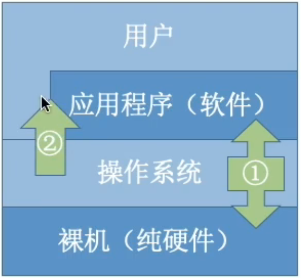

# 操作系统基本概念

## 一. 概念  
- 负责管理和协调硬件、软件等计算机资源的工作  
- 为上层用户、应用程序提供简单易用的服务  
- 是一种系统软件

## 二. 计算机系统组成部分
### 由下而上分为四个部分:
- **硬件**
- **操作系统**
- **应用程序**
- **用户**

## 三. 操作系统的功能和目标
**1. 资源的管理者[^exemple1]：**  
- **处理器管理** 
- **存储器管理**
- **文件管理**  
- **设备管理**

**2. 向上层提供服务：**  
- 给普通用户使用: **命令接口**[^命令接口], **GUI用户图形界面**  
- 给程序员使用: **程序接口**通过程序调用，即系统调用

**3. 对硬件机器的扩展：**  
- **裸机**: 没有任何软件支持的计算机  
- **虚拟器(扩展机器)**: 覆盖了软件的机器

## 四.操作系统的基本特性
**1.并发性：**  
- 宏观上同时发生，微观上交替发生，与并行不同，并行是同一时刻有多个进程同时发生[^exemple2]

**2.共享性:**
- 共享性也成为资源共享，是指系统中的资源可供多个并发执行的进程共同使用
- 互斥共享方式[^exemple3]:一个时间段内只允许一个进程访问该资源
- 同时共享方式[^exemple4]:允许一个时间段内多个资源对他们同时进行访问，这里的同时是宏观上的，在微观上是交替进行的方式

**3.虚拟性：**
- 虚拟是指将一个物理上的实体变为若干逻辑上的对应物，前者是实际存在的，后者是用户感觉上的事务，用于实现虚拟的技术称为虚拟技术。虚拟技术可归纳为：时分复用技术，空分复用技术  
- 时分复用技术:例如虚拟处理器，在单核CPU的电脑上，存在多个应用，一个应用需要被分配一个处理器,在同时使用这些应用的时候，实际上只有一个处理器，但是用户感觉上有多个处理器在同时为自己服务
- 空分复用技术:例如虚拟存储器，在一个内存为4G的电脑上，同时运行多个应用时，需要的内存远大于4G,那么在用户看来，这个电脑上的内存大于4G，这就是虚拟存储器

**4.异步性：**
- 多道程序环境允许多个应用并发执行，但是资源是有限的，进程的执行并不是一贯到底的，而是走走停停，等到资源可以被获取之后，再继续执行

### 注意
- 并发性和共享性是相互依存的，如果没有并发性，意味着程序的执行将会是依次执行，也就不需要资源的共享。如果没有共享性，资源无法共享，那么程序就不能并发的执行

### 脚注
[^exemple1]: 以QQ视频聊天为例：  
    - **Step 1:** 在各个文件夹中找到QQ的文件位置 (文件管理)  
    - **Step 2:** 双击打开 `QQ.exe` (将程序放到内存中，存储器管理)  
    - **Step 3:** QQ程序正常运行 (处理器管理)  
    - **Step 4:** 开始和朋友聊天 (打开摄像头，设备管理)  

[^命令接口]: 分为两种，分别是：  
    - **脱机命令接口**: 如 CMD 终端，一条一条指令的读取  
    - **联机命令接口**: 如 BAT 批处理文件，多条指令一次性读取

[^exemple2]:以约会为例:
    - **并发性**: 小渣在同一天内与不同的人约会，在宏观上看是统一时间，在**微观上看不同时间段**都在与不同的人约会
    - **并行**: 老渣在同一时间段**同时**和a、b约会

[^exemple3]:以视频电话为例：
    使用QQ和微信进行视频通话时，同一时间段摄像头只能分配给一个进程使用，这就是**互斥共享方式**

[^exemple4]:以传输文件为例: 
    使用QQ和微信发送文件时，看似两个软件在同时读取磁盘内的内容是，实际上两个应用在**交替**访问磁盘中的资源，这就是**同时共享方式**
